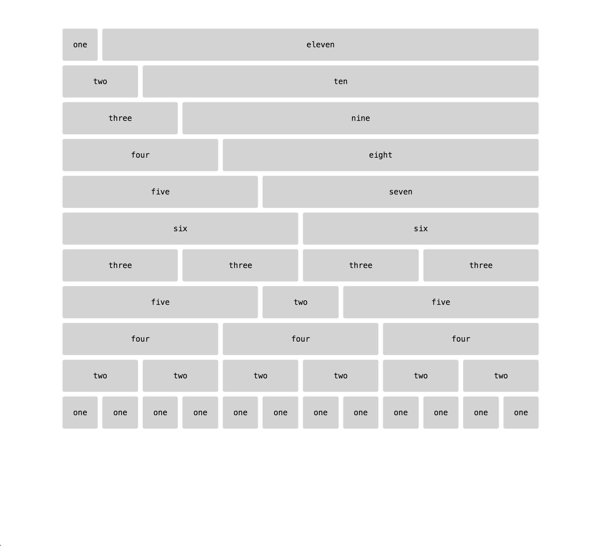

#12 Column Grid for Thomas (Desktop & Mobile)

###About
There are a lot of grid systems out there. Sometimes though, customization is tough; there are just too many style rules to easily overwrite with confidence. Even my favorite, [Skeleton](http://getskeleton.com/), is tricky to make quick ajustments to, and also comes with a lot of stuff I don't always need. This is my attempt at the simplest possible grid system. 

###Use

####Install
 - `bower install grid-for-thomas --save-dev`
 - add syle link to HTML file `  <link rel="stylesheet" href="./css/grid.css" />`
####Edit and Mark Up
Adjust the padding and margin in the `grid.scss` file using `$padding-amount-x/y` and `$margin-amount-x/y`. 

Mark it up like this:

```
  <div class="row">
    <div class="five columns">
      five
    </div>
    <div class="two columns">
      two
    </div>     
    <div class="five columns">
      five
    </div>
  </div>
```

Now you have a grid. Here's a sample:

