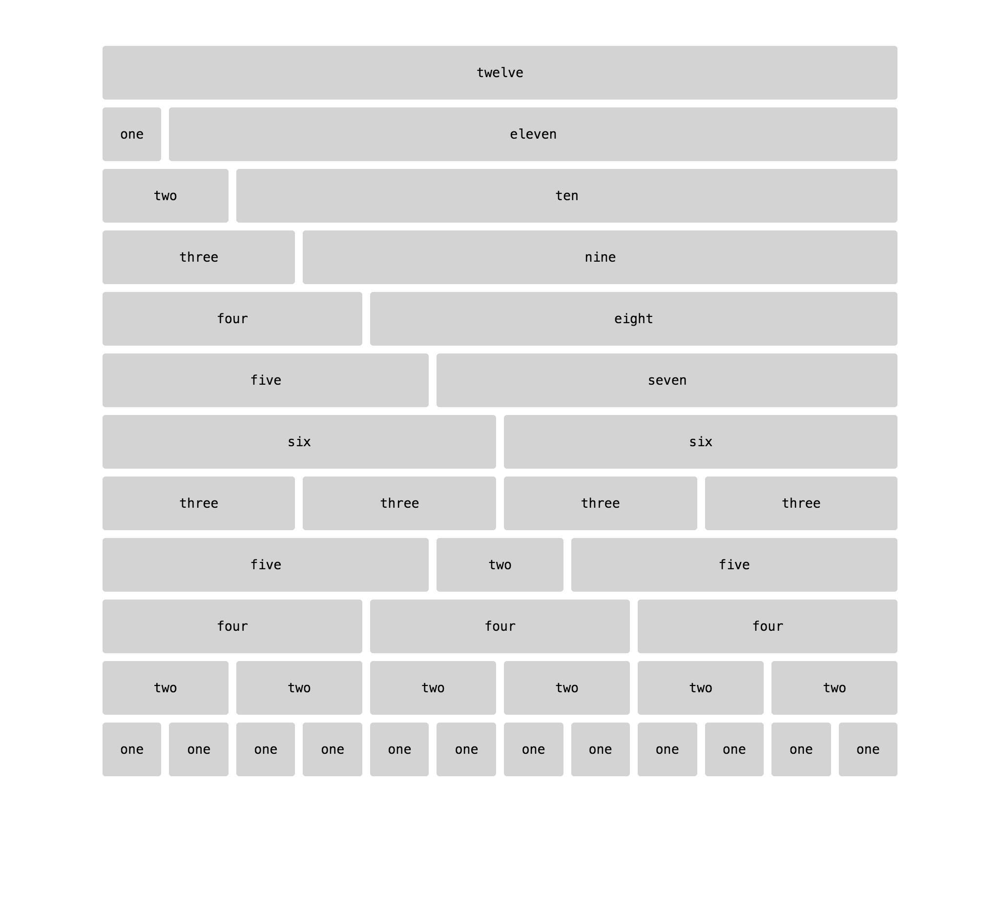

#12 Column Grid for Thomas (Desktop & Mobile)

###About
I needed a grid system that allows me to instantly change gutter widths and padding on a whim and without any hassle. Even my favorite, Skeleton, doesn't allow me to do this very easily. It can be tricky to make quick ajustments to, and also comes with a lot of stuff I don't always need. Unavoidably, this is a heavier system than I'd like. It's 500 lines. But it is a perfectly customizable grid and should meet the needs of anyone who needs to quickly bootstrap a layout without having to worry about learning the idiosyncracies of a library. $gutter: npx is all you need.

###Use

####Install
 - `bower install grid-for-thomas --save-dev`
 - add syle link to HTML file `  <link rel="stylesheet" href="./css/grid.css" />`

####Edit and Mark Up
Adjust the padding and margin in the `grid.scss` file using `$padding-amount-x/y` and `$margin-amount-x/y`. 

####Mark it Up

```
  <div class="row">
    <div class="five columns">
      five
    </div>
    <div class="two columns">
      two
    </div>     
    <div class="five columns">
      five
    </div>
  </div>
```

Now you have a grid. Here's a sample:


